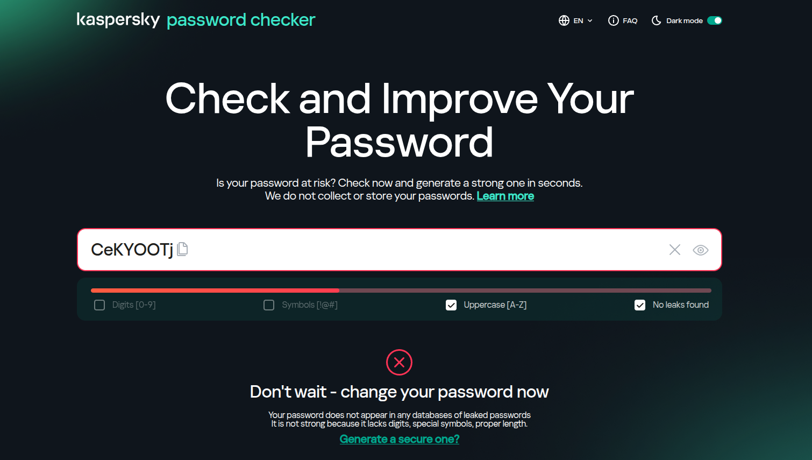
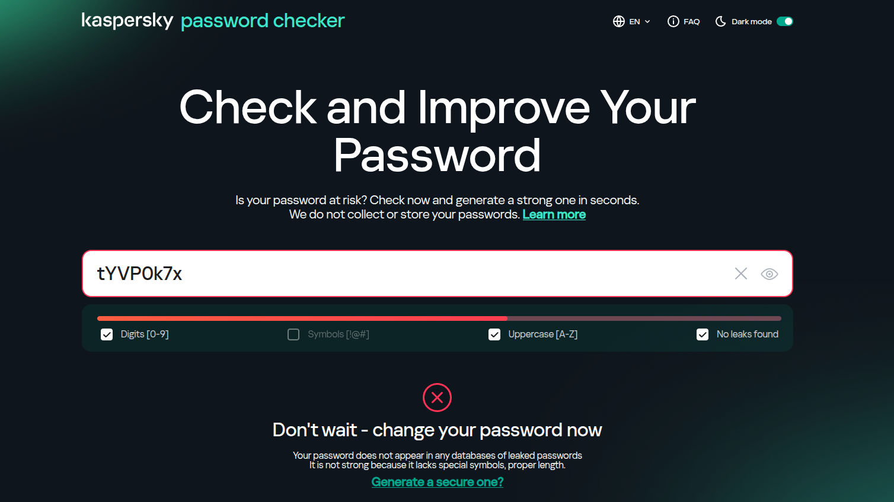
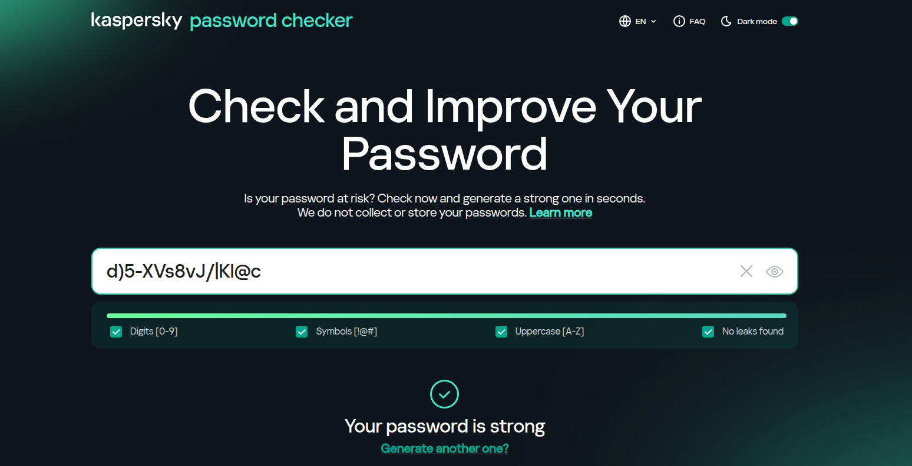

# Internship – Day 6 : Password Strength Evaluation with Python Script

Password security is a crucial aspect of protecting personal and organizational digital assets. In this task, a Python CLI script was developed to generate passwords of varying complexity. Each password was then analyzed using Kaspersky’s password strength checker to evaluate security and understand best practices for creating robust passwords.

---

## Steps Performed

1. **Created Python CLI Password Generator**
   
   - Developed a Python script (`passgen.py`) using `argparse`.
   
   - The script supports multiple flags for customization:
     
     ```
     -l LENGTH, --length LENGTH      Length of the password
     -s, --symbols                  Include symbols
     -i, --integers                 Include integers
     -u, --no-upper                  Exclude uppercase letters
     -n, --no-lower                  Exclude lowercase letters
     -c COUNT, --count COUNT         Number of passwords to generate
     ```
   
   - Example usage to generate a 12-character password with symbols and integers:
     
     ```bash
     python3 passgen.py -l 12 -s -i -c 1
     ```
     
     we get:
     
     ```bash
     )}:{NvM3N[{P
     ```

---

2. **Generated Passwords with Increasing Complexity**
   
   **Phase 1: 8-character password, letters only**
   
   - Command:
     
     ```bash
     python3 passgen.py -l 8 -c 1
     ```
   
   - Generated password: `CeKYOOTj`
     
     
   
   - Tested on Kaspersky: scored weak due to low complexity.

---

**Phase 2: 8-character password with integers**

- Command:
  
  ```bash
  python3 passgen.py -l 8 -i -c 1
  ```

- Generated password: `tYVP0k7x`
  
  

- Kaspersky score improved but still low; feedback highlighted addition of numbers.

---

**Phase 3: 8-character password with integers and symbols**

- Command:
  
  ```bash
  python3 passgen.py -l 8 -i -s -c 1
  ```

- Generated password: `E5}@{#BX`
  
  

- Kaspersky score stronger; feedback praised inclusion of symbols for added security.

---

**Phase 4: 16-character password with uppercase, lowercase, integers, and symbols**

- Command:
  
  ```bash
  python3 passgen.py -l 16 -i -s -c 1
  ```

- Generated password: `d)5-XVs8vJ/|Kl@c`
  
  

- Kaspersky scored very strong; feedback confirmed high security due to length and character variety.

---

## Observations and Analysis

- Increasing complexity and length **directly improves password strength**.

- Including **numbers and symbols** significantly enhances security against dictionary attacks.

- Longer passwords with **mixed case, numbers, and symbols** are highly resistant to brute-force attacks.

- Feedback from Kaspersky provides **clear guidance for best practices** in creating secure passwords.

---

## Summary

In today’s task, a Python CLI script was used to generate passwords of varying complexity, which were then evaluated using Kaspersky’s password strength checker. Starting from simple 8-character letters-only passwords to fully complex 16-character passwords with uppercase, lowercase, integers, and symbols, the exercise demonstrated how **password length and character diversity impact overall security**. Feedback from Kaspersky emphasized **best practices**, including using long, unpredictable passwords with a mix of character types. This task reinforced practical skills in **automated password generation and security analysis**.
